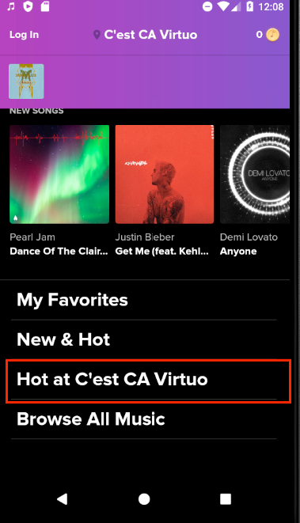

# mobile-qa-tech-assignment

This is the home assignment to assess your coding skills and test design skills. Please use Appium with any Appium client and push your code to a public git repository, alongside with instruction to set up environment and to run your code. Follow the **page object model**. Good Luck!

# Notes:

1. The APK file of application under test is here: https://apkpure.com/touchtunes/com.touchtunes.android 

2. The instructions on how to setup Appium can be found here: https://www.swtestacademy.com/how-to-install-appium-on-mac/

3. When users first opens the application, there is an onboarding flow that they can do. You can either test the flow or simply skip it.

4. You can use any jukebox that you want. If location is important for your test, please provide GPS coordinates 

 

# Question:

Choose any jukebox location. Open “Hot at \<jukebox name\>” menu on the home page, than open “Hot Artists” menu. 

    

Verify that the artists displayed on this page are aligned with the artists displayed at “HOT AT \<jukebox name\>” vertical list of the home page.

    

